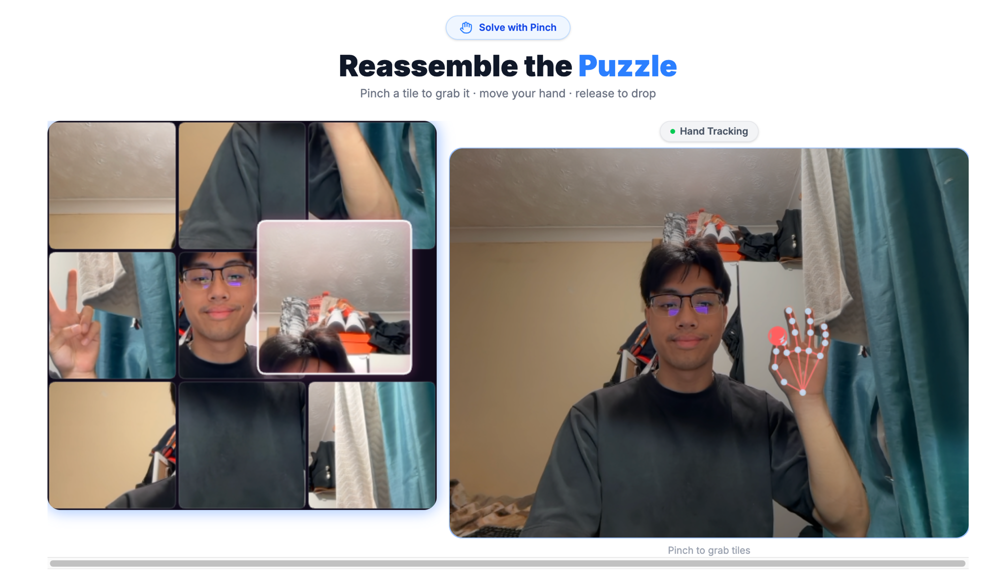

# Webcam Puzzle Sort

A webcam-based CAPTCHA that replaces the boring checkbox with a real human challenge: take a selfie, then solve a sliding tile puzzle using hand pinch gestures tracked live by your camera.



## How it works

1. **Check the box** — click "I'm not a robot" to activate the camera
2. **Take a selfie** — your face becomes the puzzle image
3. **Solve the puzzle** — pinch tiles with your fingers and swap them back into order

---

## Key Components

### `WebcamCapture`
The entry screen. Renders the CAPTCHA-style checkbox and, once checked, shows a live mirrored camera preview. Captures a square crop of the video frame on button press and passes the image data URL upstream to kick off the puzzle phase.

### `PuzzleBoard`
The core game screen. Slices the captured selfie into a 3×3 grid of tiles and renders them on a canvas. Runs two parallel `requestAnimationFrame` loops:
- **Main loop** — reads hand state each frame, handles pinch pick-up and drop logic, and redraws the puzzle. When a tile is released it calls `swapTiles`, which triggers a re-render and restarts the loop with the updated tile order.
- **Hand feed loop** — draws a small 160×160 side-panel showing the live mirrored video with the hand skeleton overlaid so the user can see where their hand is.

Solved state is detected when every tile index matches its slot (`tiles[i] === i` for all 9).

### `useHandTracking`
A React hook that loads MediaPipe `HandLandmarker` from CDN (WASM runtime + `.task` model file). Runs a `requestAnimationFrame` detection loop and writes results into a **ref** (not state) so the puzzle's rAF loops can read hand position on every frame without triggering React re-renders.

Pinch is detected when the distance between landmark 4 (thumb tip) and landmark 8 (index tip) falls below `0.030` normalized units, with a hysteresis threshold of `0.048` to release. Cursor position is amplified by a `SENSITIVITY` multiplier so smaller hand movements cover the full canvas.

### `usePuzzle`
Manages the tile array state for the 3×3 grid. `tiles[slot]` holds the index of the image tile shown in that slot. Exposes a `swapTiles(a, b)` function used by `PuzzleBoard` when the user drops a tile onto a new position.

### `HandOverlay`
Draws the hand skeleton (bones + landmark dots) onto a canvas using the raw landmark array from MediaPipe. Used by `PuzzleBoard`'s hand feed loop to visualize tracking in the side panel.

### `SuccessScreen`
Shown after the puzzle is solved. Displays a completion message and a reset button that returns the app to the capture phase.

---

## Tech Stack

- React + Vite
- MediaPipe `HandLandmarker` (CDN) for real-time hand tracking
- Canvas API for all puzzle and overlay rendering
- Tailwind CSS v4 + shadcn/ui

## Commands

```bash
npm install
npm run dev      # Start dev server with hot reload
npm run build    # Production build → dist/
npm run preview  # Preview the production build
```
